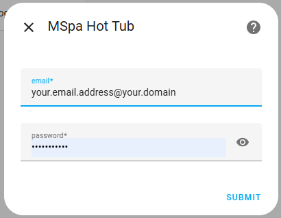
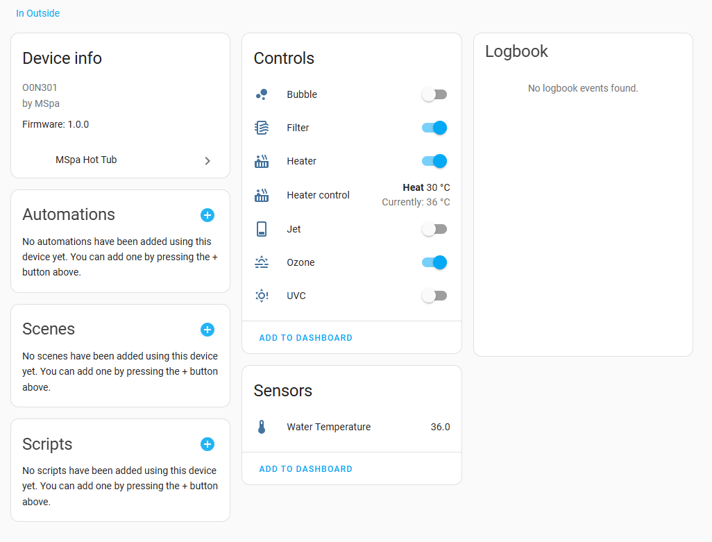
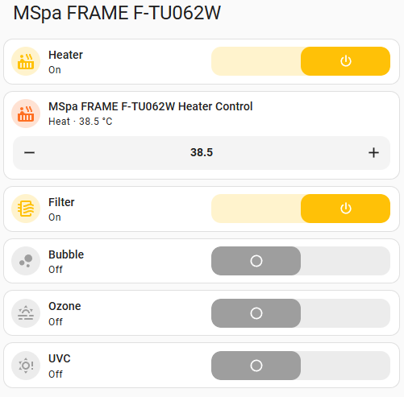

# MSpa Custom Component Integration and Installation via HACS

 

This repository contains a custom Home Assistant component. You can easily install it using [HACS](https://hacs.xyz/).

## Overview

This custom Home Assistant integration implements a device to control an MSPA hot tub.  
It allows users to monitor and control various functions of their MSPA hot tub directly from Home Assistant, enabling automation and remote management.

Key features:
- Turn the hot tub on or off
- Adjust temperature settings
- Control bubbles and filtration
- Monitor current status and temperature

Refer to the installation and configuration instructions below to get started.

## Installation

1. **Add this repository to HACS:**
    - In Home Assistant, go to **HACS**.
    - Click the three dots in the top right and select **Custom repositories**.
    - Enter the URL of this repository and select **Integration** as the category.
    - Click **Download**.
    - Now restart homeassistant to load the new integration.

2. **Install the Integration:**
    - After adding the repository, search for the custom component in HACS.
    - Click **Install**.

3. **Restart Home Assistant:**
    - Go to **Settings** > **System** > **Restart** to apply the changes.

4. **Configure the Integration:**
    - Follow the documentation or configuration instructions specific to this component.

## Configuration

After installation, you will need to configure the integration in Home Assistant. Before carrying out these steps it is recommended to 
create a guest account on the MSPA Link app to avoid using your main account credentials. Refer to the article here 
to create a guest account: [Creating a Guest Account in the MSPA Link App](MSPA_LINK.md).

To configure the MSPA integration in Home Assistant:
1. Go to **Settings** > **Devices & Services**.
2. Click on **Add Integration**.
3. Search for **mspa** and select it.
4. Enter the required information:
   - `email`: Your guest email for the MSPA account.
   - `password`: The MSPA account password for the guest user.

   

5. Click **Submit** to complete the configuration.
6. You can now control your MSPA hot tub through Home Assistant.

If the registration is successful then you will see your device and 
some entities for monitoring and controlling it .

## Integration page

## Device page

7. You can now add the entities to your dashboard or use them in automations.

   - **Example Entities:**
     - `switch.mspa_hot_tub_heater`: To turn the hot tub on or off.
     - `sensor.mspa_hot_tub_water_temperature`: To monitor the current temperature.
     - `switch.mspa_hot_tub_bubbles`: To control the bubbles.
     - `switch.mspa_hot_tub_filter`: To control the filtration system.

## Thermostat popup

## Example dashboard using mushroom cards:

## Troubleshooting

- Make sure you are running the latest version of HACS.
- Check the Home Assistant logs for any errors if the component does not load.
- Ensure that you have created and are using a guest account for Home Assistant with its own email and password in the MSPA Link app.
- you can only have one mspa integration per Home Assistant instance. If you have multiple MSPA hot tubs, you will need to set up separate instances of Home Assistant for each one.

## Support

For issues or feature requests, please open an issue in this repository.