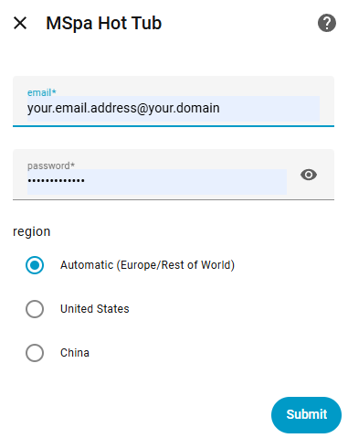
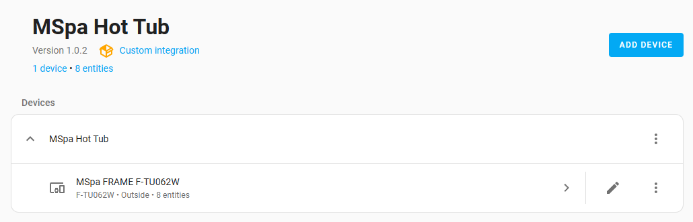
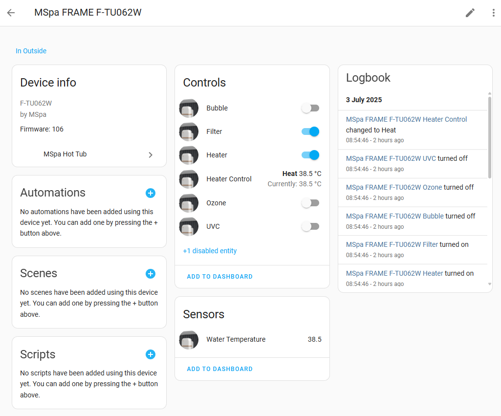
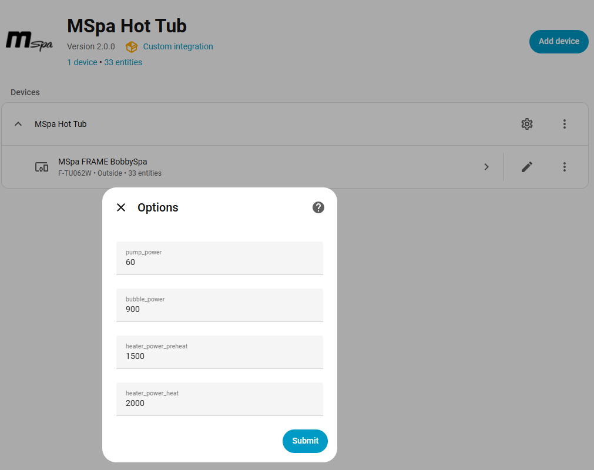

# MSpa Custom Component Integration and Installation via HACS

[![hacs][hacs-badge]][hacs-url]
![Maintenance][maintenance-badge]
[![release][release-badge]][release-url]
![downloads][downloads-badge]

This repository contains a custom Home Assistant component. You can easily install it using [HACS](https://hacs.xyz/).

## Overview

This custom Home Assistant integration implements a device to control an MSPA hot tub.  
It allows users to monitor and control various functions of their MSPA hot tub directly from Home Assistant, enabling automation and remote management.

Key features:
- Turn the hot tub on or off
- Adjust temperature settings
- Control bubbles and filtration
- Monitor current status and temperature

Refer to the installation and configuration instructions below to get started.

## Installation

1. **Add this repository to HACS:**
    - In Home Assistant, go to **HACS**.
    - Click the three dots in the top right and select **Custom repositories**.
    - Enter the URL of this repository and select **Integration** as the category.
    - Click **ADD**.

2. **Install the Integration:**
    - After adding the repository, search for the custom component "MSPA Hot Tub integration" in HACS.
    - Click **Download** in the 3-dots menu, or click on the entry in HACS and click the blue **DOWNLOAD** button.

3. **Restart Home Assistant:**
    - Go to **Settings** > **System** > **Restart** to apply the changes.
    - Alternatively Home Assistant will provide a "repair" in settings that you may click on to restart Home Assistant. 

4. **Configure the Integration:**
    - Follow the documentation or configuration instructions specific to this component below.

## Configuration

After installation, you will need to configure the integration in Home Assistant. Before carrying out these steps it is recommended to 
create a guest account on the MSPA Link app to avoid using your main account credentials. Refer to the article here 
to create a guest account: [Creating a Guest Account in the MSPA Link App](MSPA_LINK.md).

To configure the MSPA integration in Home Assistant:

1. Go to **Settings** > **Devices & Services**.
2. Click on **Add Integration**.
3. Search for **mspa** and select it.
4. Enter the required information:
    - `email`: Your guest email for the MSPA account.
    - `password`: The MSPA account password for the guest user.
    - `region`: The integration will auto-detect your region based on your Home Assistant country setting. You can override this if needed:
      - **ROW (Rest of World/Europe)**: For European and other global regions (api.iot.the-mspa.com)
      - **US**: For United States and Canada (api.usiot.the-mspa.com)
      - **CH**: For China, Hong Kong, and Macau (api.mspa.mxchip.com.cn)

    
    
    > **Note on Multi-Region Support**: Multi-region support is **new and experimental**. While the ROW (Europe) region is well-tested, the US and CH regions have had limited testing. The region endpoints were identified from the [openHAB MSpa binding](https://github.com/weymann/openhab-addons/tree/main/bundles/org.openhab.binding.mspa). If you use the US or CH regions, please provide feedback on whether the integration works correctly in your region by opening an issue on GitHub.

5. Click **Submit** to complete the configuration.
6. If the registration is successful, you will see your device and some entities for monitoring and controlling it.
7. You can now add the entities to your dashboard or use them in automations.

   - **Example Entities:**
     - `switch.mspa_hot_tub_heater`: To turn the hot tub on or off.
     - `sensor.mspa_hot_tub_water_temperature`: To monitor the current temperature.
     - `sensor.mspa_hot_tub_heater_power`: To monitor the current power consumption.
     - `switch.mspa_hot_tub_bubbles`: To control the bubbles.
     - `switch.mspa_hot_tub_filter`: To control the filtration system.
     - `sensor.mspa_hot_tub_fault`: To monitor the current fault status.

## Integration page

## Device page

## Enabling the Filter status Sensor

If your MSpa device supports filter status monitoring, a `Filter status` sensor will be available in Home Assistant after installing or upgrading this integration.  
By default, diagnostic sensors like the Filter state sensor are disabled in the entity registry. It should state in
the manual for your mspa whether your mspa supports filter status monitoring.

To enable it:

1. Go to **Settings** > **Devices & Services** > **Entities** in Home Assistant.
2. Search for `Filter status` under your MSpa device.
3. Click the `Filter status` sensor and enable it.

The Filter status sensor will show `OK` when the filter is clean, and `Dirty` if the filter needs to be changed (when the warning code is `A0`).

## Heating action (hvac_action)

The integration also provides `hvac_action` as part of the climate sensor that indicates the current heating state of the hot tub.
The climate entity will show the following states:
- `off`: The hot tub is turned off.
- `idle`: The hot tub is on but not actively heating. This would normally be the state when the water is at or above the desired temperature.
- `preheating`: The hot tub is in preheat mode (heat_state = 2), warming up the water before entering full heating mode.
- `heating`: The hot tub is actively heating the water (heat_state = 3).

## Power and Energy Monitoring

The integration provides comprehensive power and energy monitoring for your hot tub, including individual component sensors and total power/energy tracking that can be added directly to Home Assistant's Energy dashboard.

### Power Sensors

The integration provides the following power sensors that report real-time power consumption in watts:

- **Pump Power**: Reports pump power consumption (default: 60W when running)
- **Bubble Power**: Reports bubble blower power consumption (default: 900W when running)
- **Heater Power**: Reports heater power consumption based on heating state:
  - Preheat mode: 1500W (default)
  - Heating mode: 2000W (default)
  - Idle/off: 0W
- **Total Power**: Automatically calculates the sum of all active components and provides a breakdown in the sensor attributes

### Energy Sensor (Energy Dashboard Compatible)

The integration includes a **Total Energy** sensor that:
- Tracks cumulative energy consumption in kWh
- Uses the **Energy** device class for direct compatibility with Home Assistant's Energy dashboard
- Persists across Home Assistant restarts
- Calculates energy using trapezoidal integration for accuracy
- Can be added to the Energy dashboard under individual devices

To add the energy sensor to your Energy dashboard:
1. Go to **Settings** > **Dashboards** > **Energy**
2. Click **Add Consumption** under "Individual Devices"
3. Select your `Total Energy` sensor from the MSpa device
4. Click **Save**

### Calibrating Power Consumption Values

The default power consumption values are based on typical MSpa specifications, but actual power usage may vary by model and region. You can calibrate these values to match your specific hot tub:

1. **Find your MSpa specifications**: Check your hot tub's manual or specification plate for the actual power ratings of:
   - Filter pump (typically 40-80W)
   - Bubble blower (typically 800-1000W)
   - Heater during preheat (typically 1200-1500W)
   - Heater during normal heating (typically 1800-2200W)

2. **Adjust the values**:
   - Go to **Settings** > **Devices & Services** > **MSpa**
   - Click the **⚙️ cog wheel button** (Configure) on your MSpa integration
   - Enter the power consumption values for your specific model:
     - **Pump Power** (default: 60W)
     - **Bubble Power** (default: 900W)
     - **Heater Power (Preheat)** (default: 1500W)
     - **Heater Power (Heat)** (default: 2000W)
   - Click **Submit**
   
   

3. **Fine-tune based on experience**: If you have a way to measure actual power consumption (e.g., smart plug with power monitoring), you can further refine these values based on real-world measurements.

**Note**: The MSpa Comfort C-BE061 specifications show:
- Filter pump: 60W
- Bubble blower: 900W
- Heater: 1500W (preheat) / 2000W (heating)

These are used as defaults, but your model may differ.

## Thermostat popup

## Example dashboard using mushroom cards:

## Limitations

- **Regional Restriction:** The integration currently only works with MSPA installations in the European region. Installations outside Europe are not supported at this time.
- It is not currently possible to determine which features your specific MSPA hot tub supports. If you find that some features, such as jet or ozone, do not work, it may be due to the specific model of your hot tub. You can disable the relevant entities in the Home Assistant UI.
- The safety lock feature is not available in this integration. You can still operate the safety lock through the MSPA Link app.

## Troubleshooting

- Make sure you are running the latest version of HACS.
- Check the Home Assistant logs for any errors if the component does not load.
- Ensure that you have created and are using a guest account for Home Assistant with its own email and password in the MSPA Link app.
- you can only have one mspa integration per Home Assistant instance. If you have multiple MSPA hot tubs, you will need to set up separate instances of Home Assistant for each one.

## Support

For issues or feature requests, please open an issue in this repository.

<!-- Badges -->
[hacs-badge]: https://img.shields.io/badge/HACS-Custom-orange.svg?style=flat-square
[release-badge]: https://img.shields.io/github/v/release/jm-cook/mspa-homeassistant?style=flat-square
## Limitations

- It is not currently possible to determine which features your specific MSPA hot tub supports. If you find that some features, such as jet or ozone, do not work, it may be due to the specific model of your hot tub. You can disable the relevant entities in the Home Assistant UI.
- The safety lock feature is not available in this integration. You can still operate the safety lock through the MSPA Link app.
- Power consumption values are estimates based on typical specifications. For accurate energy tracking, calibrate the values based on your hot tub's specifications or measured power consumption.

## Troubleshooting